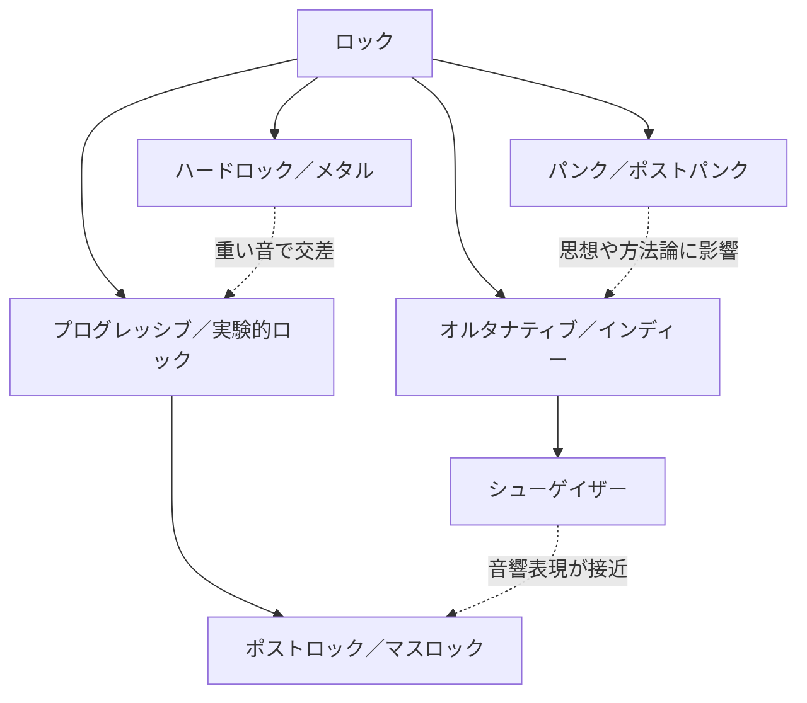

# ロックの分野ガイド

ロックは、エレキギター、ベース、ドラムを中心に発展してきた音楽の大きなまとまりである。ただし、同じバンドでも作品ごとに音が変わり、複数の分野へまたがることが多い。

このガイドでは、厳密な境界を決めるのではなく、気になった音から次のバンドを探すための「入口」として分野を整理する。

## 分野の見取り図

この図は理解のための簡略化であり、完全な系譜図ではない。たとえばシューゲイザーはオルタナティブ／インディーロックの一分野として扱われる一方、ドリームポップやポストロックとも音の特徴が重なる。

## まず聴き分けるポイント

| 分野 | 簡単な説明 | 音の目印 |
| --- | --- | --- |
| [[alternative-rock-and-shoegaze\|オルタナティブ／シューゲイザー]] | 主流の定型から外れた表現を広く含む。シューゲイザーはその中で音の層や質感を重視する | 歪み、フィードバック、浮遊感、埋もれた歌声 |
| [[punk-and-post-punk\|パンク／ポストパンク]] | 簡潔で直接的なパンクと、その方法を拡張したポストパンク | 速さ、反復、切迫感、鋭いリズム |
| [[hard-rock-and-metal\|ハードロック／メタル]] | 大音量、重いリフ、強い演奏を軸に発展した分野 | 太いギター、低音、強い打撃感 |
| [[progressive-and-post-rock\|プログレッシブ／ポストロック]] | 曲の構造、拍子、音色、展開そのものを実験する | 長い展開、変拍子、静と動、器楽中心 |

## バンドから探す

[[rock-band-classification|2010年以降も活動を続けるロックバンド20組の分類表]]では、各バンドの主分類、関連分野、音の入口、近年の活動例を横断して確認できる。

羊文学は表では「オルタナティブロック」を主分類とし、シューゲイザーとドリームポップを関連分野にしている。公式プロフィールの分類と、楽曲に見られる音響的な特徴を分けて記録するためである。

## 分類を見るときの注意

- ジャンル名は、演奏者自身、レーベル、批評家、聴き手で使い方が異なる。
- 「オルタナティブ」は特定の音だけでなく、主流に対する立ち位置を示す場合がある。
- 「インディー」は音の分類だけでなく、独立系レーベルやDIYの制作姿勢を示す場合がある。
- 一つのバンドを一つの欄に固定せず、主分類と関連分野を一緒に見る。
- 活動状況は変わるため、分類表では確認日と近年の活動例を確認する。

## 関連ページ

- [[alternative-rock-and-shoegaze]]
- [[punk-and-post-punk]]
- [[hard-rock-and-metal]]
- [[progressive-and-post-rock]]
- [[rock-band-classification]]

## 主な参考資料

- [AllMusic: Alternative/Indie Rock](https://www.allmusic.com/genre/alternative-indie-rock-ma0000012230)
- [AllMusic: Shoegaze](https://www.allmusic.com/genre/shoegaze-ma0000004454)
- [AllMusic: Post-Rock](https://www.allmusic.com/style/post-rock-ma0000002790)
- [AllMusic: Math Rock](https://www.allmusic.com/style/math-rock-ma0000012250)

確認日: 2026-07-31
